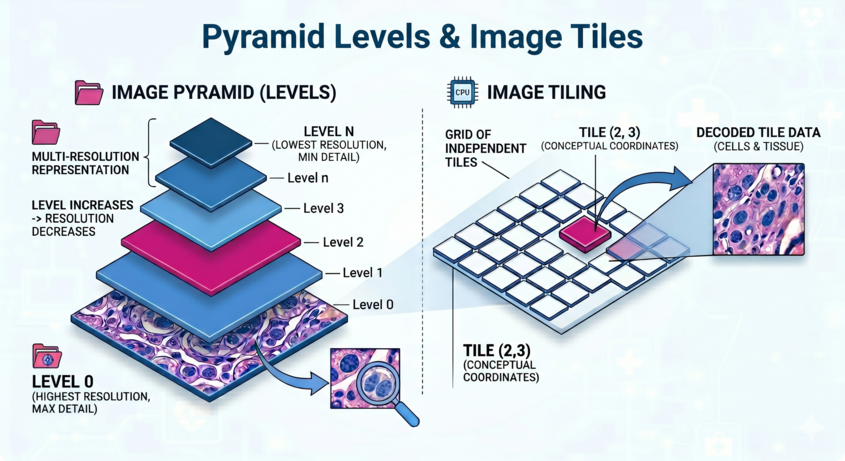

# Eozin Python

Eozin for Python provides high-performance digital pathology image decoding, 
powered by a core engine implemented in pure Rust.

## Installing Eozin

You can install Eozin using `pip` or any package manager that supports PyPI.

```bash
pip install eozin
```

```bash
uv pip install eozin
```

```bash
poetry add eozin
```

## Quickstart

The API is basically similar to [OpenSlide-python](https://openslide.org/api/python/).

```python
from eozin import Eozin
from PIL import Image

# Load a slide image
slide = Eozin("/some/slide.svs")

# Get dimensions of the slide at level 0 (full resolution)
slide_width, slide_height = slide.dimensions

# Get the index of the lowest resolution level
lowest_resolution_level = slide.level_count - 1

# level_tile_ranges returns a list of tuples: 
# [(horizontal_tiles, vertical_tiles), ...]
lowres_tile_ranges = slide.level_tile_ranges[lowest_resolution_level]

# Retrieve the tile at the center of the level
# lowres_tile_ranges[0] is the width in tiles, and [1] is the height in tiles.
lowres_centered_tile: Image.Image = slide.read_tile(
  lowest_resolution_level, 
  lowres_tile_ranges[0] // 2, 
  lowres_tile_ranges[1] // 2, 
)
lowres_centered_tile.show()

# Extract a specific region (OpenSlide-like API)
# read_region(location, level, size)
region: Image.Image = slide.read_region((0, 0), 0, (1024, 1024))
```

For more details, please refer to the [API reference](reference.md).


## Concept of this library



Digital pathology images are very large, sometimes exceeding 100,000 pixels. 
Since loading the entire image in standard formats is impractical, 
they are designed as containers consisting of small rectangular images called **"tiles"**.

Furthermore, since downscaling these images on the fly is computationally expensive,
they typically store multiple lower-resolution versions, referred to as **levels**. 
Vendors have developed various proprietary formats, and libraries like 
OpenSlide and bioformats have been instrumental in handling them.

Eozin is designed to provide lightweight, low-latency access to these tiles. 
Specifically, each tile is stored as a fragmented byte sequence; Eozin calculates 
the byte offset based on the requested level and coordinates, then appends 
the necessary headers so the buffer can be interpreted as a standard image format.

Decoding each tile is handled by `Pillow`. This minimizes overhead and enables 
fast tile access. The `read_tile` method simply retrieves the actual image tile, 
making it suitable for applications such as creating GUI drawing applications 
or performing image recognition by scanning tiles one by one.

The `read_region` method is almost equivalent to the 
[OpenSlide Python API](https://openslide.org/api/python/) 
and allows you to extract any range. Unlike OpenSlide, it does not maintain 
an internal cache, so if you repeatedly access the same region, 
please consider caching on your end.


## Note
Vendor and file format names mentioned in this library are the property of their respective owners.
This library is not certified for clinical use.
